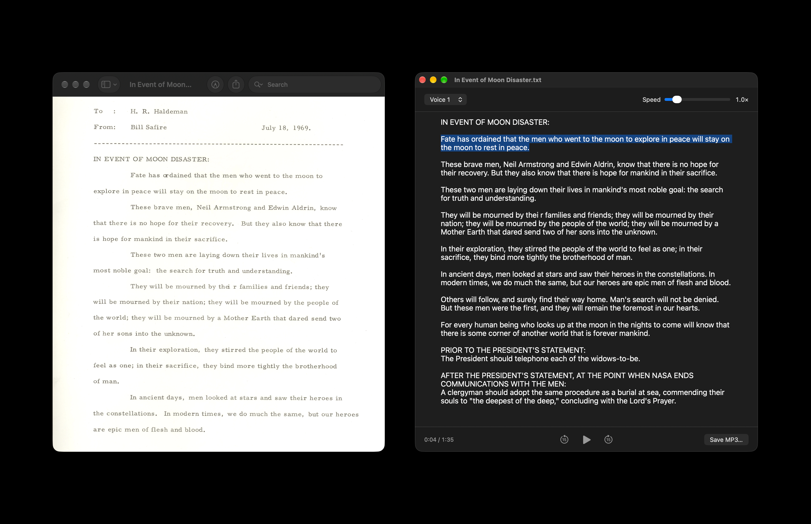

<picture><source media="(prefers-color-scheme: dark)" srcset="docs/icon-github-dark.png"></picture>

# TTS

Text to speech app for Mac. Reads text aloud with the voices of macOS, Siri’s included, and saves it as MP3.



Apple silicon, macOS 13 or later.

## Install

```sh
brew install geragarazagh/tap/tts
```

Or download [`TTS.dmg`](https://github.com/geragarazagh/tts/releases/latest/download/TTS.dmg).
